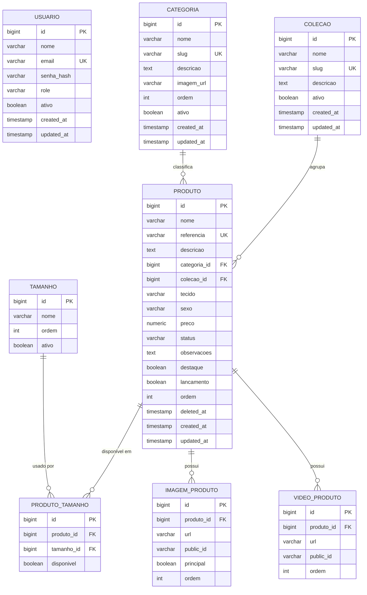

# Modelo de Dados — Fruto da Malha Catálogo

Fonte da verdade executável: `backend/src/main/resources/db/migration/V1__create_schema.sql`
(Flyway). Este documento é a referência de leitura humana — mantenha os dois sincronizados.

## Diagrama entidade-relacionamento

## Entidades

### Usuario
Representa quem acessa o painel administrativo. Hoje só existe o papel `ADMIN`; o campo `role`
já é um enum para permitir `VENDEDOR` no futuro (ver Arquitetura §5) sem alterar o schema.

### Categoria
Categorias livres criadas pela administradora (Macacão Curto, Body, Vestidos, Promoções,
Lançamentos, ...). `ordem` controla a posição de exibição na home/menu (drag-and-drop no painel
grava um novo valor de `ordem` para cada categoria afetada). `imagem_url` é a foto de capa da
categoria (Cloudinary).

### Colecao
Linha/coleção do produto (ex.: "Verão 2026", "Inverno Baby"). Opcional por produto.

### Tamanho
Tabela de tamanhos administrável (não é enum) porque roupa infantil usa nomenclaturas variadas e
não padronizadas entre negócios (RN, P, M, G, GG, 1, 2, 3 anos, ...). `ordem` define a sequência
correta de exibição (ex.: RN antes de P, P antes de M), que **não** é alfabética.

### Produto
Entidade central do catálogo. `referencia` é o identificador público/estável — é o mesmo código
que a loja já usa no catálogo em PDF e que a cliente cita ao negociar pelo WhatsApp — e por isso
é também o identificador usado na URL (`/produto/000180`), sem um `slug` textual separado
(diferente de Categoria/Coleção, que não têm um código equivalente e por isso usam slug derivado
do nome). `status` controla visibilidade pública (`ATIVO`/`INATIVO` = "ocultar"); `deleted_at` implementa
exclusão reversível (ver Arquitetura §2.5). `destaque` e `lancamento` alimentam as seções
"Produtos em destaque" e "Lançamentos" da home.

### ProdutoTamanho
Tabela de junção explícita (não M:N implícito) entre `Produto` e `Tamanho`, representando quais
tamanhos aquele produto específico tem disponíveis. `disponivel` indica só isso — se o tamanho
existe para o produto — nunca uma quantidade. **O catálogo não tem controle de estoque, por
decisão explícita de produto** (ver `docs/ARCHITECTURE.md` §5): não adicionar uma coluna de
quantidade nesta tabela nem em nenhuma outra.

### ImagemProduto / VideoProduto
Galeria de mídia do produto. Apenas `url` (Cloudinary `secure_url`) e `public_id` (para permitir
apagar o asset remoto ao excluir) são persistidos — nunca o binário. `principal` marca a imagem de
capa exibida nas listagens; `ordem` controla a sequência do carrossel/galeria na página do produto.

## Índices relevantes (ver migration para definição exata)

- `produto.referencia` — único, consultado em toda busca e na URL do produto.
- `produto.categoria_id`, `produto.colecao_id` — FKs, usados nos filtros de listagem.
- `produto.status`, `produto.deleted_at` — usados em toda query pública (filtra só ativos/não
  excluídos).
- `categoria.slug`, `colecao.slug` — únicos, usados nas rotas `/categoria/[slug]`.
- `usuario.email` — único, usado no login.
